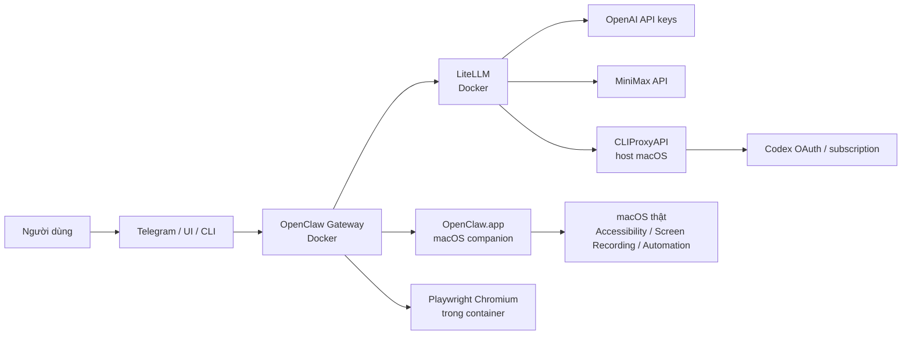

# Tài Liệu Tổng Hợp OpenClaw + Docker + macOS

## 1. Mục tiêu của stack hiện tại

Mục tiêu của hệ thống này là dựng một stack `OpenClaw` chạy local trên macOS, nhưng vẫn có đủ các lớp để:

- điều khiển OpenClaw qua Docker
- dùng `LiteLLM` làm gateway chung cho model, key, routing, logging
- tận dụng cả API key truyền thống lẫn OAuth/subscription upstream
- hỗ trợ bot Telegram cho điều khiển từ xa
- hỗ trợ companion app macOS để OpenClaw thao tác trên máy Mac thật
- hỗ trợ browser automation trong container qua Playwright Chromium

Kiến trúc hiện tại không còn là bản Docker mặc định tối giản nữa, mà là một stack đã được custom lại để phục vụ các use case thực tế trên macOS.

## 2. Kiến trúc tổng thể hiện tại

Luồng chuẩn đang dùng:



Tách vai như sau:

- `OpenClaw Gateway`: control plane, orchestration, channel Telegram, bridge tới macOS companion app, bridge tới browser
- `LiteLLM`: lớp proxy model trung tâm, virtual key, routing, retry, load balancing, chuẩn hóa API
- `CLIProxyAPI`: bridge từ OAuth/subscription sang endpoint kiểu OpenAI-compatible
- `OpenClaw.app`: node chạy trên macOS thật để thao tác OS-level
- `Playwright Chromium`: browser headless chạy trong container phục vụ tool browser của OpenClaw

## 3. Luồng request đang chạy thực tế

### 3.1. Luồng Telegram

```text
Telegram user
-> Telegram bot
-> OpenClaw gateway
-> LiteLLM
-> một trong các upstream sau:
   - OpenAI key trực tiếp
   - MiniMax key trực tiếp
   - CLIProxyAPI -> Codex OAuth
-> kết quả trả lại OpenClaw
-> Telegram bot
```

### 3.2. Luồng macOS companion

```text
OpenClaw Gateway (Docker)
-> kết nối WebSocket local tới OpenClaw.app
-> OpenClaw.app chạy trên macOS thật
-> macOS permissions:
   Accessibility / Screen Recording / Automation
-> thao tác trực tiếp trên desktop thật
```

### 3.3. Luồng browser tool

```text
OpenClaw Gateway
-> gọi browser tool
-> wrapper /usr/local/bin/openclaw-playwright-chrome
-> Playwright Chromium cache trong container
-> browser headless phục vụ automation / web actions
```

### 3.4. Luồng Codex OAuth qua CLIProxyAPI

```text
OpenClaw
-> LiteLLM model alias: codex-oauth-gpt-5-1-codex
-> CLIProxyAPI local trên host macOS
-> auth file đã sync từ ~/.codex/auth.json
-> upstream Codex OAuth/subscription
```

Đây là case đã được research và triển khai để tận dụng subscription/OAuth mà vẫn giữ `LiteLLM` là lớp gateway chính.

## 4. Thành phần đang chạy

### 4.1. Docker services

Stack Docker live nằm ở:

- `/Users/macos/Downloads/openclaw-litellm-macos-stack`

Các container chính:

- `oc-postgres`
- `oc-litellm`
- `oc-openclaw-gateway`

Trạng thái hiện tại đã xác nhận:

- `postgres`: healthy
- `litellm`: healthy
- `openclaw-gateway`: healthy

### 4.2. Host service ngoài Docker

Ngoài Docker còn có:

- `cliproxyapi` chạy qua `brew services`

Vai trò:

- nhận request model kiểu OpenAI-compatible từ `LiteLLM`
- dùng auth file OAuth/subscription ở local host
- trả model response về lại `LiteLLM`

## 5. Port và endpoint hiện tại

### 5.1. OpenClaw

- Gateway UI/API: `http://127.0.0.1:18789`
- Bridge port: `127.0.0.1:18790`
- Browser relay port: `127.0.0.1:18792`

Health endpoints:

- `http://127.0.0.1:18789/healthz`
- `http://127.0.0.1:18789/readyz`

### 5.2. LiteLLM

- API: `http://127.0.0.1:4000`
- Health: `http://127.0.0.1:8001`

Endpoint hay dùng:

- `http://127.0.0.1:4000/v1/models`
- `http://127.0.0.1:8001/health/readiness`

### 5.3. CLIProxyAPI

- Direct API: `http://127.0.0.1:8317`
- Management UI: `http://127.0.0.1:8317/management.html`

Management API ví dụ:

- `GET http://127.0.0.1:8317/v0/management/auth-files`

Lưu ý:

- management đang bật `local-only`
- không expose remote

## 6. Timeline triển khai từ đầu tới giờ

### Bước 1. Dựng OpenClaw + LiteLLM + Postgres trên macOS

Đã làm:

- xác nhận máy là `arm64`
- dùng image pin ổn định cho `OpenClaw` và `LiteLLM`
- dựng stack `Postgres + LiteLLM + OpenClaw Gateway`
- cấu hình `gateway.mode=local`

Kết quả:

- stack Docker chạy ổn
- health endpoint của `OpenClaw` và `LiteLLM` đều OK

### Bước 2. Gắn Telegram bot

Đã làm:

- thêm `TELEGRAM_BOT_TOKEN`
- bật channel Telegram trong `openclaw.json`
- pair user Telegram
- approve user id `7121054800`

Kết quả:

- bot Telegram hoạt động
- OpenClaw không còn báo `access not configured`

### Bước 3. Pair OpenClaw với macOS thật

Đã làm:

- cài `OpenClaw.app` vào `/Applications`
- cấu hình `~/.openclaw/openclaw.json` ở chế độ remote
- pair app với gateway Docker

Kết quả:

- OpenClaw có đường điều khiển macOS thật
- cần quyền macOS ở `Privacy & Security` để thao tác desktop

### Bước 4. Thêm MiniMax

Đã làm:

- thêm `MINIMAX_API_KEY`
- research endpoint đúng
- chốt `MINIMAX_API_BASE=https://api.minimax.io/v1`
- add model `MiniMax-M2.5` và `MiniMax-M2.1`

Sự cố gặp phải:

- dùng endpoint `.com` bị `401 invalid api key`
- LiteLLM báo `UnsupportedParamsError` vì MiniMax không support `reasoning_effort`

Fix:

- đổi base sang `.io`
- bật `litellm_settings.drop_params: true`

Kết quả:

- MiniMax gọi được qua LiteLLM

### Bước 5. Thêm multi-key OpenAI

Đã làm:

- mở rộng `.env` hỗ trợ `OPENAI_API_KEY`, `OPENAI_API_KEY_2`, `_3`, `_4`
- viết renderer sinh `config/litellm-config.yaml` từ env
- dùng repeated deployment cho cùng model

Routing:

- `routing_strategy: simple-shuffle`
- `num_retries: 3`
- retry cho auth, rate limit, timeout, internal server error

Kết quả:

- LiteLLM hỗ trợ load balance / failover cho nhiều OpenAI key

### Bước 6. Thêm smoke test

Đã làm:

- viết `scripts/test-model.sh`

Mục đích:

- test health toàn stack
- test GPT qua LiteLLM
- test MiniMax qua LiteLLM
- test CLIProxy path qua LiteLLM
- test Telegram end-to-end

### Bước 7. Research 9router vs CLIProxyAPI

Kết luận kiến trúc:

- với case đã có `LiteLLM`, nếu chỉ cần bridge OAuth/subscription thì `CLIProxyAPI` hợp hơn `9router`
- lý do không phải vì `9router` yếu, mà vì `9router` chồng vai nhiều hơn với `LiteLLM`

Kiến trúc chốt:

```text
OpenClaw -> LiteLLM -> CLIProxyAPI -> OAuth/subscription upstreams
```

### Bước 8. Triển khai CLIProxyAPI

Đã làm:

- cài `cliproxyapi` qua Homebrew
- sync auth Codex từ `~/.codex/auth.json`
- render file config riêng
- cho `LiteLLM` gọi tới `http://host.docker.internal:8317/v1`
- thêm alias model `codex-oauth-*`

Kết quả:

- `LiteLLM -> CLIProxyAPI -> Codex OAuth` chạy được
- inference thật qua đường này đã pass

### Bước 9. Bật web management/login cho CLIProxyAPI

Đã làm:

- thêm `CLIPROXY_MANAGEMENT_KEY`
- bật control panel
- giữ `allow-remote: false`

Kết quả:

- truy cập local ở `http://127.0.0.1:8317/management.html`
- xem được auth files của Codex

### Bước 10. Hoàn thiện browser automation cho OpenClaw

Đã làm:

- custom image `openclaw-browser-local:latest`
- mount Playwright browser cache
- thêm wrapper script mở Chromium
- thêm script startup dọn stale lock của browser

Kết quả:

- browser tool chạy trong container ổn định hơn
- tránh lỗi Chromium singleton lock sau restart

### Bước 11. Thêm scaffolding cho DangLamGiau / HOCAI

Đã làm:

- research docs `https://danglamgiau.com/docs`
- chốt rằng đây là một upstream OpenAI-compatible marketplace, không phải bridge OAuth
- thêm biến env `DANGLAMGIAU_*`
- thêm renderer để LiteLLM có thể expose alias `dlg-*`
- thêm helper script để query trực tiếp `/v1/models`
- thêm smoke-test nhánh riêng cho `DangLamGiau`

Kiến trúc áp dụng:

```text
OpenClaw -> LiteLLM -> DangLamGiau /v1
```

Trạng thái hiện tại:

- code path đã sẵn sàng
- provider đang để `disabled` cho tới khi có `DANGLAMGIAU_API_KEY` thật
- không làm đổi primary model hiện tại của OpenClaw

## 7. Cấu hình hiện tại từng lớp

### 7.1. `.env`

File live:

- `/Users/macos/Downloads/openclaw-litellm-macos-stack/.env`

Đây là file chứa gần như toàn bộ secret/runtime config:

- image pin
- port
- gateway token
- Telegram bot token
- LiteLLM master key
- LiteLLM virtual API key cho OpenClaw
- OpenAI keys
- MiniMax key
- CLIProxy API key
- CLIProxy management key
- Postgres credentials

Không được commit file này.

### 7.2. `config/openclaw.json`

File:

- `/Users/macos/Downloads/openclaw-litellm-macos-stack/config/openclaw.json`

Điểm quan trọng:

- model primary hiện tại: `litellm/codex-oauth-gpt-5-1-codex`
- OpenClaw gọi model qua provider `litellm`
- browser đang bật
- Telegram đang bật
- gateway mode đang là `local`
- bind là `lan`

Model đang khai báo cho OpenClaw:

- `litellm/gpt-5.4`
- `litellm/codex-oauth-gpt-5-1-codex`
- `litellm/gpt-5.1-codex`
- `litellm/MiniMax-M2.5`
- `litellm/MiniMax-M2.1`

Telegram hiện tại:

- DM policy: allowlist
- group policy: allowlist
- allowFrom: user `7121054800`
- group chat yêu cầu mention

### 7.3. `config/litellm-config.yaml`

File:

- `/Users/macos/Downloads/openclaw-litellm-macos-stack/config/litellm-config.yaml`

File này được generate tự động từ `.env`.

Ý nghĩa:

- gom nhiều OpenAI key thành nhiều deployment trùng model
- thêm model MiniMax
- thêm model bridge qua CLIProxyAPI
- bật router + retry
- bật `drop_params: true`

Model hiện có:

- `gpt-5.4`
- `gpt-5.1-codex`
- `MiniMax-M2.5`
- `MiniMax-M2.1`
- `codex-oauth-gpt-5-codex`
- `codex-oauth-gpt-5-1-codex`
- `codex-oauth-gpt-5-1-codex-max`

Khi bật `DANGLAMGIAU_ENABLE=1`, LiteLLM sẽ sinh thêm các alias `dlg-*` theo `DANGLAMGIAU_MODELS`.

### 7.4. `config/cliproxyapi-config.yaml`

File:

- `/Users/macos/Downloads/openclaw-litellm-macos-stack/config/cliproxyapi-config.yaml`

Điểm chính:

- host: `127.0.0.1`
- port: `8317`
- `allow-remote: false`
- control panel đang bật
- auth-dir trỏ tới thư mục local trong stack
- routing `round-robin`

### 7.5. `docker-compose.yml`

File:

- `/Users/macos/Downloads/openclaw-litellm-macos-stack/docker-compose.yml`

Điểm khác với bản Docker đơn giản:

- `openclaw-gateway` và `openclaw-cli` được build từ `docker/openclaw-browser.Dockerfile`
- image runtime là `openclaw-browser-local:latest`
- có thêm mount cho Playwright cache
- có mount wrapper browser và gateway start script
- publish thêm port browser relay `18792`

### 7.6. `~/.openclaw/openclaw.json`

File:

- `/Users/macos/.openclaw/openclaw.json`

Vai trò:

- cấu hình companion app OpenClaw trên macOS thật

Hiện tại:

- mode: `remote`
- transport: `direct`
- url: `ws://127.0.0.1:18789`
- browser enabled

## 8. Browser và macOS companion

Đây là hai thành phần rất dễ bị nhầm với nhau.

### Browser trong container

Mục đích:

- cho OpenClaw dùng browser automation
- chạy headless
- không phụ thuộc GUI của macOS

File liên quan:

- `/Users/macos/Downloads/openclaw-litellm-macos-stack/scripts/openclaw-playwright-chrome.sh`
- `/Users/macos/Downloads/openclaw-litellm-macos-stack/scripts/openclaw-gateway-start.sh`

`openclaw-playwright-chrome.sh`:

- tìm Chromium trong cache của Playwright
- nếu chưa có thì báo lệnh cài browser

`openclaw-gateway-start.sh`:

- dọn `SingletonLock`, `SingletonSocket`, `SingletonCookie`
- rồi mới start gateway

### OpenClaw.app trên macOS

Mục đích:

- cho OpenClaw điều khiển máy Mac thật
- tương tác desktop, accessibility, screen capture, automation

Phụ thuộc:

- quyền trong `System Settings > Privacy & Security`

Cần bật:

- `Accessibility`
- `Screen Recording` hoặc `Screen & System Audio Recording`
- `Automation`

Nếu không có các quyền này thì OpenClaw vẫn pair được nhưng không thao tác OS-level ổn định.

## 9. Telegram hiện tại

Bot Telegram đã được tích hợp vào stack.

Luồng triển khai đã làm:

- thêm bot token
- bật provider Telegram trong OpenClaw
- pair user
- approve user
- allowlist user Telegram

Current behavior:

- DM với bot hoạt động
- group chat chỉ hoạt động nếu:
  - group được allowlist
  - có mention bot

File liên quan:

- `/Users/macos/Downloads/openclaw-litellm-macos-stack/config/openclaw.json`
- `/Users/macos/Downloads/openclaw-litellm-macos-stack/data/openclaw/config/credentials/telegram-allowFrom.json`

## 10. Multi-key OpenAI hiện tại

Stack đang hỗ trợ nhiều OpenAI key ở lớp LiteLLM.

Cách hoạt động:

- thêm `OPENAI_API_KEY`, `OPENAI_API_KEY_2`, `OPENAI_API_KEY_3`, `OPENAI_API_KEY_4`
- script render sẽ:
  - bỏ key rỗng
  - bỏ key trùng
  - sinh nhiều deployment cho cùng `gpt-5.4`
  - sinh nhiều deployment cho cùng `gpt-5.1-codex`

Lợi ích:

- load balancing
- failover khi một key rate limit hoặc lỗi

Lưu ý:

- đây là multi-key ở `LiteLLM`
- `OpenClaw` không biết có bao nhiêu key phía sau
- `OpenClaw` chỉ giữ đúng một `LITELLM_API_KEY`

## 11. MiniMax hiện tại

Đã tích hợp MiniMax thành công qua LiteLLM.

Điểm phải nhớ:

- endpoint đúng là `https://api.minimax.io/v1`
- không dùng `.com` cho key đang có

Model đang expose:

- `MiniMax-M2.5`
- `MiniMax-M2.1`

Sự cố đã gặp:

- LiteLLM báo MiniMax không support `reasoning_effort`

Fix:

- `litellm_settings.drop_params: true`

Ý nghĩa:

- những param OpenAI-style mà upstream không hỗ trợ sẽ bị LiteLLM bỏ đi

## 12. CLIProxyAPI hiện tại

### 12.1. Vì sao có CLIProxyAPI

Mục tiêu:

- biến OAuth/subscription upstream thành endpoint chuẩn để `LiteLLM` gọi được

Thay vì để OpenClaw gọi trực tiếp:

- `OpenClaw -> LiteLLM -> CLIProxyAPI -> Codex OAuth`

Kiến trúc này giúp:

- giữ logging/budget/routing tập trung ở LiteLLM
- dùng subscription/OAuth mà không trộn logic đó vào OpenClaw

### 12.2. Auth hiện tại lấy từ đâu

Auth Codex được sync từ:

- `/Users/macos/.codex/auth.json`

Sang:

- `/Users/macos/Downloads/openclaw-litellm-macos-stack/data/cliproxyapi/auths`

Hiện management API đang thấy 2 auth files Codex active. Điều đó có nghĩa là CLIProxyAPI đang nhìn thấy session usable. Về vận hành thì dùng được, nhưng lâu dài nên chỉ giữ một bản chuẩn nếu muốn thư mục auth gọn hơn.

### 12.3. Management UI

Management web UI:

- `http://127.0.0.1:8317/management.html`

Dùng key:

- `CLIPROXY_MANAGEMENT_KEY` trong `.env`

Phân biệt:

- `CLIPROXY_MANAGEMENT_KEY`: đăng nhập phần quản trị
- `CLIPROXY_API_KEY`: key để model client gọi `/v1/...`

### 12.4. Model alias qua LiteLLM

Các model alias đang đi qua CLIProxyAPI:

- `codex-oauth-gpt-5-codex`
- `codex-oauth-gpt-5-1-codex`
- `codex-oauth-gpt-5-1-codex-max`

OpenClaw hiện đang dùng primary:

- `litellm/codex-oauth-gpt-5-1-codex`

## 13. Script và chức năng

### 13.1. Apply provider config

File:

- `/Users/macos/Downloads/openclaw-litellm-macos-stack/scripts/apply-provider-config.sh`

Khi dùng:

- sau khi sửa `.env` liên quan OpenAI / MiniMax / provider model

Việc script làm:

- render lại `litellm-config.yaml`
- recreate `litellm`, `openclaw-gateway`, `openclaw-cli`
- chờ health xong mới kết thúc

### 13.2. Apply CLIProxyAPI

File:

- `/Users/macos/Downloads/openclaw-litellm-macos-stack/scripts/apply-cliproxyapi.sh`

Khi dùng:

- sau khi đổi auth Codex
- sau khi đổi config CLIProxy
- khi muốn sync lại từ `~/.codex/auth.json`

Việc script làm:

- kiểm tra `cliproxyapi`
- render config host-side
- sync auth Codex
- copy config vào Homebrew etc
- restart `brew services`
- test CLIProxy từ host và từ container
- render lại LiteLLM config
- recreate Docker services cần thiết

### 13.3. Render LiteLLM config

File:

- `/Users/macos/Downloads/openclaw-litellm-macos-stack/scripts/render-litellm-config.py`

Vai trò:

- generate file config từ `.env`
- hỗ trợ multi-key OpenAI
- hỗ trợ MiniMax
- hỗ trợ CLIProxy bridge
- bật `drop_params`

### 13.4. Render CLIProxy config

File:

- `/Users/macos/Downloads/openclaw-litellm-macos-stack/scripts/render-cliproxy-config.py`

Vai trò:

- generate config CLIProxy từ `.env`
- chốt `host`, `port`, `management key`, `auth-dir`, `api-keys`

### 13.5. Sync Codex auth

File:

- `/Users/macos/Downloads/openclaw-litellm-macos-stack/scripts/sync-cliproxy-codex-auth.py`

Vai trò:

- đọc `~/.codex/auth.json`
- tách token cần thiết
- decode `id_token`
- generate auth file phù hợp cho CLIProxyAPI

### 13.6. Generate LiteLLM virtual key

File:

- `/Users/macos/Downloads/openclaw-litellm-macos-stack/scripts/generate-litellm-virtual-key.sh`

Vai trò:

- gọi `LiteLLM /key/generate`
- tạo virtual key cho OpenClaw dùng
- tự add model alias CLIProxy vào danh sách allow nếu đang bật bridge

### 13.7. Smoke test

File:

- `/Users/macos/Downloads/openclaw-litellm-macos-stack/scripts/test-model.sh`

Vai trò:

- test health
- test GPT
- test MiniMax
- test DangLamGiau
- test CLIProxy
- test Telegram end-to-end

### 13.8. Discover model ids của DangLamGiau

File:

- `/Users/macos/Downloads/openclaw-litellm-macos-stack/scripts/discover-danglamgiau-models.sh`

Vai trò:

- gọi trực tiếp `GET /v1/models` của `danglamgiau.com`
- in ra danh sách `model_id`
- giúp chốt `DANGLAMGIAU_MODELS` trước khi bật alias trong LiteLLM

## 14. Cách vận hành thường ngày

### 14.1. Kiểm tra stack

```bash
cd /Users/macos/Downloads/openclaw-litellm-macos-stack
docker compose ps
curl -fsS http://127.0.0.1:18789/readyz
curl -fsS http://127.0.0.1:8001/health/readiness
brew services list | rg cliproxyapi
```

### 14.2. Xem model hiện có qua LiteLLM

```bash
curl -fsS http://127.0.0.1:4000/v1/models \
  -H "Authorization: Bearer $LITELLM_API_KEY"
```

### 14.3. Re-apply provider config sau khi đổi key

```bash
cd /Users/macos/Downloads/openclaw-litellm-macos-stack
./scripts/apply-provider-config.sh
```

### 14.4. Re-apply CLIProxy sau khi đổi login Codex

```bash
cd /Users/macos/Downloads/openclaw-litellm-macos-stack
./scripts/apply-cliproxyapi.sh
```

### 14.5. Chạy smoke test

```bash
cd /Users/macos/Downloads/openclaw-litellm-macos-stack
./scripts/test-model.sh
```

Ví dụ bỏ qua một số phần:

```bash
SKIP_GPT=1 ./scripts/test-model.sh
SKIP_TELEGRAM=1 ./scripts/test-model.sh
SKIP_MINIMAX=1 SKIP_GPT=1 ./scripts/test-model.sh
```

## 15. Cách login / dùng CLIProxyAPI

### 15.1. Login hiện tại

Hiện hệ thống đang dùng session Codex đã sync từ:

- `/Users/macos/.codex/auth.json`

Nó không bắt buộc phải login qua web UI mỗi lần.

### 15.2. Nếu muốn login lại Codex

Binary host:

- `/opt/homebrew/opt/cliproxyapi/bin/cliproxyapi`

Ví dụ:

```bash
/opt/homebrew/opt/cliproxyapi/bin/cliproxyapi -config /opt/homebrew/etc/cliproxyapi.conf -codex-login
```

Hoặc:

```bash
/opt/homebrew/opt/cliproxyapi/bin/cliproxyapi -config /opt/homebrew/etc/cliproxyapi.conf -codex-device-login
```

Sau khi login lại, nên chạy:

```bash
cd /Users/macos/Downloads/openclaw-litellm-macos-stack
./scripts/apply-cliproxyapi.sh
```

### 15.3. Gọi trực tiếp CLIProxyAPI

```bash
curl http://127.0.0.1:8317/v1/chat/completions \
  -H "Authorization: Bearer $CLIPROXY_API_KEY" \
  -H "Content-Type: application/json" \
  -d '{
    "model": "gpt-5.1-codex",
    "messages": [{"role": "user", "content": "Reply with exactly OK"}]
  }'
```

### 15.4. Gọi qua LiteLLM

```bash
curl http://127.0.0.1:4000/v1/chat/completions \
  -H "Authorization: Bearer $LITELLM_API_KEY" \
  -H "Content-Type: application/json" \
  -d '{
    "model": "codex-oauth-gpt-5-1-codex",
    "messages": [{"role": "user", "content": "Reply with exactly OK"}]
  }'
```

## 16. Cách đổi model mặc định của OpenClaw

Ví dụ đổi sang Codex OAuth:

```bash
cd /Users/macos/Downloads/openclaw-litellm-macos-stack
docker compose run --rm openclaw-cli models set litellm/codex-oauth-gpt-5-1-codex
```

Ví dụ đổi sang MiniMax:

```bash
cd /Users/macos/Downloads/openclaw-litellm-macos-stack
docker compose run --rm openclaw-cli models set litellm/MiniMax-M2.5
```

Ví dụ đổi sang OpenAI key trực tiếp qua LiteLLM:

```bash
cd /Users/macos/Downloads/openclaw-litellm-macos-stack
docker compose run --rm openclaw-cli models set litellm/gpt-5.4
```

## 17. Các sự cố quan trọng đã gặp và cách xử lý

### 17.1. Telegram pair xong nhưng chưa trả lời AI

Nguyên nhân:

- Telegram access đã có
- nhưng upstream model key chưa có hoặc hết quota

Bài học:

- lỗi pairing và lỗi model là hai lớp khác nhau

### 17.2. OpenAI key hết quota

Triệu chứng:

- LiteLLM trả `429 insufficient_quota`

Fix:

- thêm nhiều OpenAI key
- để LiteLLM load-balance/failover

### 17.3. MiniMax sai endpoint

Triệu chứng:

- `.com` trả `401 invalid api key`

Fix:

- dùng `https://api.minimax.io/v1`

### 17.4. MiniMax không support `reasoning_effort`

Triệu chứng:

- LiteLLM báo `UnsupportedParamsError`

Fix:

- `litellm_settings.drop_params: true`

### 17.5. LiteLLM virtual key không gọi được model mới

Triệu chứng:

- thêm model alias rồi nhưng OpenClaw gọi bị chặn

Nguyên nhân:

- `LITELLM_API_KEY` cũ không có allowlist cho model mới

Fix:

- generate lại virtual key
- update `.env`

### 17.6. Browser container bị stale singleton lock

Triệu chứng:

- Chromium không mở lại ổn sau restart

Fix:

- startup script dọn `SingletonLock`, `SingletonSocket`, `SingletonCookie`

### 17.7. Chồng tầng router/proxy

Bài toán:

- đã có LiteLLM, có nên thêm 9router hay CLIProxyAPI

Kết luận:

- với stack này, `CLIProxyAPI` hợp hơn vì nó thiên về bridge OAuth/subscription
- `9router` dễ chồng vai với `LiteLLM`

## 18. File nào an toàn để commit, file nào không

### Có thể commit

- `/Users/macos/Downloads/openclaw-litellm-macos-stack/.env.example`
- `/Users/macos/Downloads/openclaw-litellm-macos-stack/docker-compose.yml`
- `/Users/macos/Downloads/openclaw-litellm-macos-stack/config/openclaw.json`
- `/Users/macos/Downloads/openclaw-litellm-macos-stack/config/litellm-config.yaml`
- `/Users/macos/Downloads/openclaw-litellm-macos-stack/config/cliproxyapi-config.yaml`
- `/Users/macos/Downloads/openclaw-litellm-macos-stack/scripts/*`
- `/Users/macos/Downloads/openclaw-litellm-macos-stack/README.md`

### Không được commit

- `/Users/macos/Downloads/openclaw-litellm-macos-stack/.env`
- `/Users/macos/Downloads/openclaw-litellm-macos-stack/data/openclaw/config/credentials/*`
- `/Users/macos/Downloads/openclaw-litellm-macos-stack/data/openclaw/config/devices/*`
- `/Users/macos/Downloads/openclaw-litellm-macos-stack/data/openclaw/config/identity/*`
- `/Users/macos/Downloads/openclaw-litellm-macos-stack/data/postgres/*`
- `/Users/macos/Downloads/openclaw-litellm-macos-stack/data/cliproxyapi/auths/*`

Lý do:

- các file này chứa secret, OAuth tokens, pairing state, auth runtime, DB state

## 19. Trạng thái hiện tại cần nhớ

Đây là các điểm quan trọng nhất của hệ thống đang chạy:

- stack Docker đã healthy
- CLIProxyAPI host service đã started
- OpenClaw primary model hiện là `litellm/codex-oauth-gpt-5-1-codex`
- LiteLLM hiện đang bridge tới:
  - OpenAI key trực tiếp
  - MiniMax
  - CLIProxyAPI
- Telegram đã pair và allowlist user `7121054800`
- companion app macOS đã pair với gateway Docker
- browser automation trong container đã có custom wrapper và lock cleanup

## 20. Kết luận ngắn

Stack hiện tại là một kiến trúc nhiều lớp nhưng vai trò đã tách khá rõ:

- `OpenClaw` làm control plane
- `LiteLLM` làm gateway/routing/keying chung
- `CLIProxyAPI` làm bridge OAuth/subscription
- `OpenClaw.app` làm node macOS thật
- `Playwright Chromium` làm browser runtime trong container

Nếu chỉ nhìn một câu, cấu hình hiện tại có thể tóm tắt như sau:

```text
Telegram / UI / CLI
-> OpenClaw Gateway (Docker)
-> LiteLLM (Docker)
-> OpenAI key / MiniMax / CLIProxyAPI
-> nếu cần thao tác máy thật thì đi qua OpenClaw.app trên macOS
```

Đây là một stack đã vượt qua mức cài thử nghiệm cơ bản, và đã được chỉnh để dùng thực tế trên macOS với Docker, Telegram, OAuth bridge, multi-key, MiniMax và browser automation.
